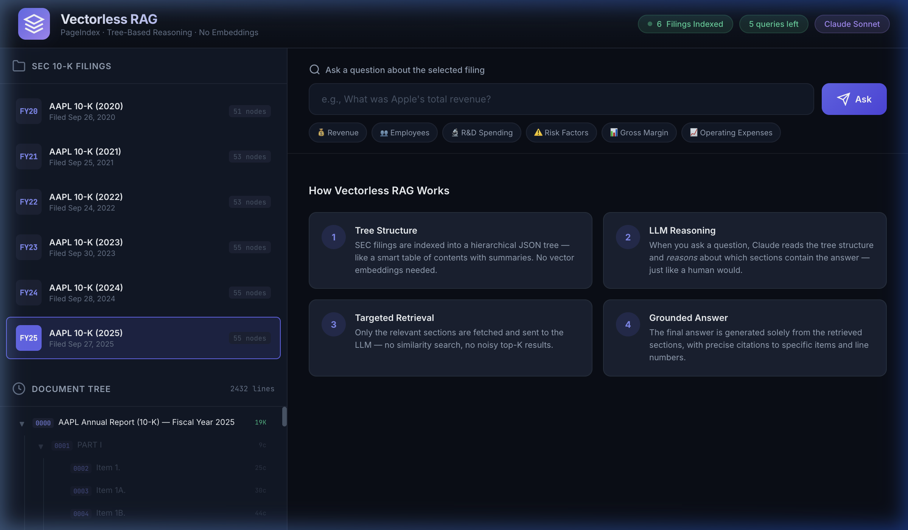
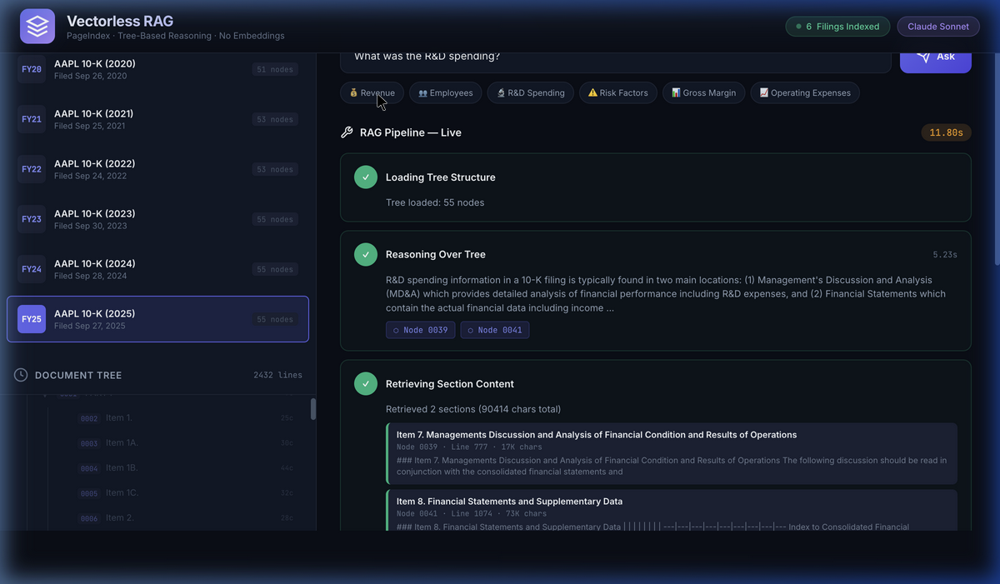
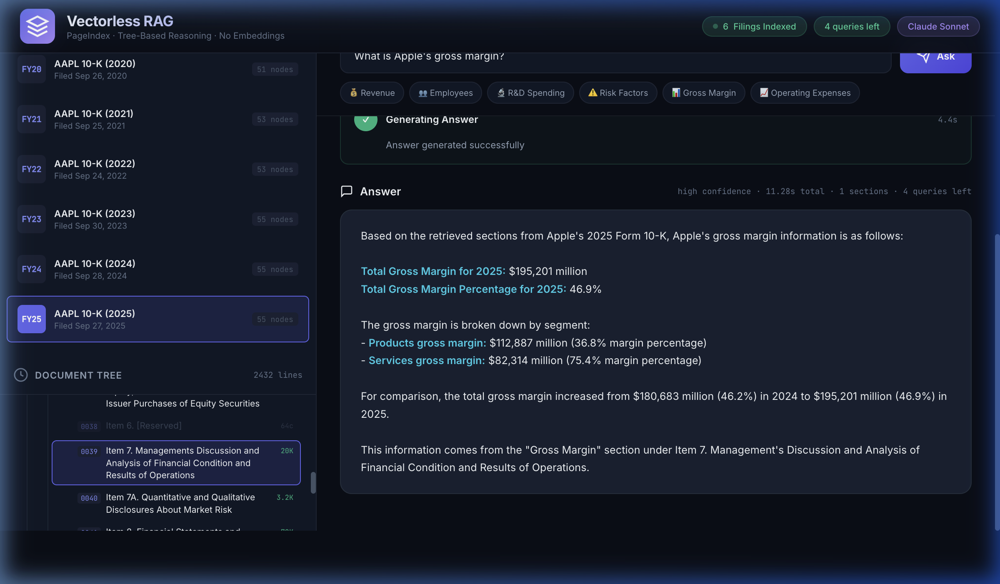

<p align="center">
  
</p>

<h1 align="center">🌲 Vectorless RAG for Apple SEC Filings</h1>

<p align="center">
  <strong>Tree-Based Reasoning Retrieval — No Vectors, No Embeddings, No Chunking</strong>
</p>

<p align="center">
  
  
  
  
  
</p>

---

## 📋 Problem Statement

**Traditional RAG (Retrieval-Augmented Generation)** systems for financial documents face critical issues:

| Problem | Impact |
|---------|--------|
| **Chunking destroys context** | A 100-page 10-K filing gets split into 500+ text chunks. Tables, cross-references, and section relationships are lost. |
| **Embeddings miss nuance** | Vector similarity search retrieves *semantically similar* text, not *structurally relevant* text. Asking "What is Apple's gross margin?" might retrieve a sentence *mentioning* margins rather than the actual financial table. |
| **Top-K is noisy** | Returning the top 5 most similar chunks often includes irrelevant content, forcing the LLM to sift through noise. |
| **No transparency** | Users can't see *why* a specific chunk was retrieved. The process is a black box. |

> **The core question:** Can we build a RAG system that retrieves information the way a *human analyst* would — by understanding the document's structure and reasoning about where the answer lives?

---

## 💡 Our Solution: Vectorless RAG with PageIndex

Instead of vectors + embeddings, we use **tree-based reasoning retrieval**:

```
Traditional RAG                          Vectorless RAG (This Project)
─────────────────                        ─────────────────────────────
Document → Chunk → Embed → Vector DB     Document → Parse → Tree Structure (JSON)
Query → Embed → Similarity Search         Query → LLM Reads Tree → Reasons About Sections
Top-K Chunks → LLM → Answer              Targeted Sections → LLM → Grounded Answer
```

### How It Works


**Step 1 — Tree Indexing:** Each 10-K filing is converted into a hierarchical JSON tree (like an intelligent table of contents). Each node contains a title, summary, and full text content.

**Step 2 — LLM Reasoning:** When you ask a question, Claude reads the tree structure (titles + summaries only) and *reasons* about which sections are most likely to contain the answer — just like a human analyst scanning a table of contents.

**Step 3 — Targeted Retrieval:** Only the relevant sections are fetched (typically 1-3 out of 55 nodes), not a noisy top-K list.

**Step 4 — Grounded Answer:** The answer is generated solely from the retrieved sections, with precise citations to specific items and line numbers.

---

## 🎯 What We Built

### Data Pipeline
- **HTML → Markdown Converter** (`convert_html_to_md.py`) — Transforms SEC EDGAR HTML filings into clean Markdown with strict heading hierarchy (`# Title` → `## PART` → `### Item`)
- **Batch Tree Indexer** (`batch_index.py`) — Generates PageIndex tree structures for all 6 filings (FY2020–FY2025)
- **Query Pipeline** (`query_sec_filing.py`) — 3-step reasoning → retrieval → synthesis pipeline

### Web Interface
- **Real-time Streaming UI** — Watch the RAG pipeline work step-by-step via Server-Sent Events
- **Interactive Tree Visualization** — Explore the document hierarchy, see which nodes get selected
- **Rate-Limited Demo** — 5 free queries to try the system (protects API costs)

<p align="center">
  
  <br>
  <em>Live pipeline: Claude reasons over the tree, selects Node 0039 (MD&A) and Node 0041 (Financial Statements), then retrieves their full content</em>
</p>

---

## 📊 Results

We tested the system across **6 Apple 10-K filings** (FY2020–FY2025). Here are sample results:

| Question | Filing | Answer | Sections Used | Time |
|----------|--------|--------|---------------|------|
| What was Apple's total revenue? | FY2025 | **$416,161M** (+6% YoY) | Item 7 — MD&A | 11.8s |
| What is Apple's gross margin? | FY2025 | **$195,201M** (46.9%) · Products: 36.8%, Services: 75.4% | Item 7 — MD&A | 11.3s |
| What was R&D spending? | FY2025 | **$34.55B** (+10% YoY from $31.37B) | Item 7 — MD&A | 9.9s |
| How many employees? | FY2025 | **166,000** FTE | Item 1 — Business | 9.9s |
| What are the main risk factors? | FY2020 | COVID-19, supply chain, competition, regulation | Item 1A — Risk Factors | 10.1s |

<p align="center">
  
  <br>
  <em>Result: Precise gross margin breakdown with Products (36.8%) vs Services (75.4%) and YoY comparison — all cited from Item 7</em>
</p>

### Why Vectorless?

| Metric | Traditional RAG | Vectorless RAG |
|--------|----------------|----------------|
| **Retrieval Precision** | Retrieves 5-10 chunks, many irrelevant | Retrieves 1-3 exact sections |
| **Context Preservation** | Chunks lose table/section context | Full sections with all tables intact |
| **Transparency** | Black box — can't explain *why* chunks were retrieved | Full reasoning trace — see *exactly* why each section was selected |
| **Setup Complexity** | Vector DB + embeddings model + chunking strategy + reranker | Just a JSON tree + LLM |
| **Cost** | Embedding cost + vector DB hosting + LLM | LLM only |

---

## 🚀 Quick Start

### Prerequisites
- Python 3.9+
- [Anthropic API Key](https://console.anthropic.com/)

### Installation

```bash
# Clone the repository
git clone https://github.com/nikhilreddy00/vectorless-rag.git
cd vectorless-rag

# Create virtual environment
python3 -m venv venv
source venv/bin/activate

# Install dependencies
pip install flask litellm anthropic python-dotenv beautifulsoup4 markdownify

# Set your API key
echo 'ANTHROPIC_API_KEY=your-key-here' > .env
```

### Run the Web Interface

```bash
python3 app.py
# Open http://localhost:5001
```

### Run from Command Line

```bash
python3 query_sec_filing.py
# Select a filing → Ask any question
```

### Re-index Filings (Optional)

```bash
# Convert HTML to Markdown
python3 convert_html_to_md.py

# Generate tree structures
python3 batch_index.py
```

---

## 📁 Project Structure

```
vectorless-rag/
│
├── app.py                      ← 🌐 Flask web server with SSE streaming
├── query_sec_filing.py         ← 📟 CLI query pipeline
├── convert_html_to_md.py       ← 🔄 HTML → structured Markdown converter
├── batch_index.py              ← 🌲 Batch tree generation for all filings
│
├── static/
│   ├── index.html              ← Frontend HTML
│   ├── style.css               ← Dark theme design system
│   └── app.js                  ← Frontend logic (tree viz, SSE, pipeline)
│
├── documents/
│   ├── aapl-20200926.html      ← Original SEC filings (HTML from EDGAR)
│   ├── ... (6 files)
│   └── markdown/               ← Converted Markdown files
│       ├── aapl-20200926.md
│       └── ... (6 files)
│
├── results/                    ← 🌲 Generated tree structures (JSON)
│   ├── aapl-20200926_structure.json  (51 nodes)
│   ├── aapl-20210925_structure.json  (53 nodes)
│   ├── aapl-20220924_structure.json  (53 nodes)
│   ├── aapl-20230930_structure.json  (55 nodes)
│   ├── aapl-20240928_structure.json  (55 nodes)
│   └── aapl-20250927_structure.json  (55 nodes)
│
├── assets/                     ← Screenshots for README
├── PageIndex/                  ← PageIndex framework (submodule)
├── .env                        ← API key (not committed)
└── usage.json                  ← Rate limit counter
```

---

## 🔧 Tech Stack

| Component | Technology |
|-----------|-----------|
| **Tree Generation** | [PageIndex](https://github.com/jasonkneen/pageindex) |
| **LLM** | Anthropic Claude Sonnet (via LiteLLM) |
| **Backend** | Flask + Server-Sent Events |
| **Frontend** | Vanilla HTML/CSS/JS (dark theme, no frameworks) |
| **Data Source** | SEC EDGAR (Apple 10-K filings, FY2020–FY2025) |

---

## ⚠️ Demo Rate Limit

The live demo is limited to **5 queries** to protect API costs. After 5 queries, the interface will show a friendly limit message. To run unlimited queries, clone the repo and use your own Anthropic API key.

To reset the counter:
```bash
rm usage.json
```

---

## 📜 License

This project is for educational and research purposes. SEC filing data is publicly available from [SEC EDGAR](https://www.sec.gov/edgar).

---

<p align="center">
  <strong>Built with 🌲 PageIndex + 🤖 Claude · No vectors were harmed in the making of this project</strong>
</p>
